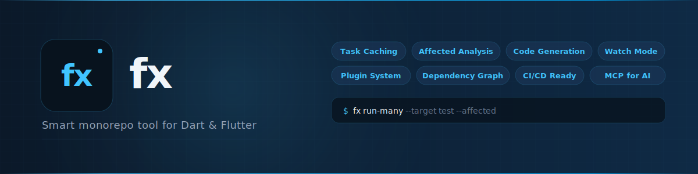
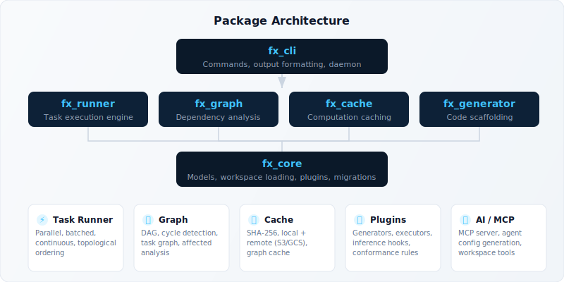

<p align="center">
  <picture>
    <source media="(prefers-color-scheme: dark)" srcset="assets/banner-dark.svg">
    <source media="(prefers-color-scheme: light)" srcset="assets/banner-dark.svg">
    
  </picture>
</p>

<p align="center">
  <strong>Smart monorepo tool for Dart & Flutter</strong>
</p>

<p align="center">
  <a href="https://github.com/rkishan516/fx/actions"></a>
  <a href="https://opensource.org/licenses/MIT"></a>
  <a href="https://dart.dev"></a>
</p>

<p align="center">
  <a href="#quick-start">Quick Start</a> &nbsp;&middot;&nbsp;
  <a href="#features">Features</a> &nbsp;&middot;&nbsp;
  <a href="#cli-reference">CLI Reference</a> &nbsp;&middot;&nbsp;
  <a href="https://fx.dev">Documentation</a> &nbsp;&middot;&nbsp;
  <a href="#architecture">Architecture</a>
</p>

---

**fx** is a monorepo management tool built for the Dart and Flutter ecosystem. It gives you task orchestration, computation caching, affected analysis, code generation, and a plugin system — all from a single CLI. Think [Nx](https://nx.dev), purpose-built for Dart.

<br>

## Quick Start

```bash
# Install
dart pub global activate --source git https://github.com/rkishan516/fx.git --git-path packages/fx_cli

# Create a workspace
fx init --name my_monorepo

# Generate packages
fx generate dart_package core
fx generate flutter_app mobile

# Run tasks across your workspace
fx run-many --target test
fx affected --target test --base main
```

<br>

## Features

### Task Orchestration

Run targets across projects with dependency-aware ordering, parallel execution, and configurable concurrency.

```bash
fx run core test                          # Single project
fx run-many --target test                 # All projects (topological order)
fx run-many --target test --parallel 8    # Custom concurrency
fx affected --target test --base main     # Only changed projects
```

**Continuous tasks** for dev servers — start without blocking, auto-cleanup on exit:

```yaml
# pubspec.yaml
fx:
  targets:
    serve:
      executor: dart run
      continuous: true
```

### Computation Caching

SHA-256 input hashing skips unchanged work. Local cache with pluggable remote stores (S3, GCS).

```bash
fx cache status        # View cache stats
fx cache clear         # Reset cache

# Enable remote cache in pubspec.yaml
fx:
  cache:
    enabled: true
    remote:
      type: s3
      bucket: my-fx-cache
```

> Typical CI speedup: **40-70%** on incremental builds by skipping unchanged packages.

### Dependency Graph

Visualize and analyze your project dependency graph. Supports JSON, DOT, web, and text output. Includes task-level graph with `dependsOn` chains.

```bash
fx graph                           # Text output
fx graph --format json             # JSON (for tooling)
fx graph --format dot              # Graphviz DOT
fx graph --tasks --format json     # Task-level graph
fx graph --detect-implicit         # Show import-inferred deps
```

### Affected Analysis

Only run tasks on projects affected by changes since a git ref. Uses the dependency graph to include downstream dependents.

```bash
fx affected --target test --base main
fx affected --target build --base HEAD~5
```

### Code Generation

Scaffold new packages, apps, and plugins from built-in or custom generators. Interactive prompts for missing parameters.

```bash
fx generate dart_package utils
fx generate flutter_app my_app
fx generate dart_cli my_tool
fx plugin list                    # See available generators
```

### Plugin System

Extend fx with custom executors, generators, conformance rules, and inference hooks.

```yaml
# pubspec.yaml
fx:
  plugins:
    - plugin: my_analyzer_plugin
      capabilities: [inference, dependencies]
      priority: 10
  generators:
    - packages/my_generator
```

Plugins can:
- **Infer projects** from non-pubspec sources (build files, configs)
- **Infer dependencies** via import analysis or custom logic
- **Provide executors** for custom build tools
- **Add conformance rules** for architecture enforcement

### Module Boundaries

Enforce architectural constraints with tag-based dependency rules and pluggable conformance checks.

```bash
fx lint                           # Run all conformance rules
```

Built-in rules: `require-target`, `require-inputs`, `require-tags`, `ban-dependency`, `max-dependencies`, `naming-convention` — plus custom rule plugins.

### CI/CD Integration

Auto-detects 9 CI providers (GitHub Actions, GitLab CI, CircleCI, Travis, Jenkins, Buildkite, CodeBuild, Azure Pipelines, Bitbucket). Provides base ref detection, log grouping, and structured CI info.

```bash
fx ci-info                        # JSON: provider, baseRef, cache paths, concurrency
fx ci-info --provider github      # Override provider detection
```

### Watch Mode

Re-run targets automatically when source files change.

```bash
fx watch --target test            # Watch all projects
fx watch --target test --projects core,utils
```

### Migration Framework

Migrate from other tools or between plugin versions with a two-phase prepare/execute system.

```bash
fx migrate --from-melos           # Convert from melos
fx migrate --list                 # Show available migrations
fx migrate --plugin my_plugin --from 1.0.0 --to 2.0.0
fx migrate --dry-run              # Preview changes
```

### Background Daemon

Persistent process that maintains the project graph in memory for instant queries. Incremental updates via git-based change detection.

```bash
fx daemon start                   # Start background process
fx daemon stop                    # Stop
fx daemon graph                   # Query graph instantly
```

### MCP Server

Expose workspace tools to AI assistants via the [Model Context Protocol](https://modelcontextprotocol.io).

```bash
fx mcp                            # Start MCP server
```

### IDE Extension — Fx Console

[Fx Console](https://github.com/rkishan516/fx-console) is a VS Code extension that brings the full fx experience into your editor. Equivalent to [Nx Console](https://nx.dev/getting-started/editor-setup) for the fx ecosystem.

- **Workspace Explorer** — sidebar tree view of all projects, targets, and dependencies
- **Run Targets** — click to run, with verbose, skip-cache, and advanced options
- **Code Lens** — inline Run buttons in `pubspec.yaml` target definitions
- **Dependency Graph** — interactive force-directed graph with search, focus, and affected highlighting
- **Code Generation** — form-based UI for `fx generate` with dry-run preview
- **Migration Step-Through** — review and apply migrations one at a time
- **Task History** — recent runs with status, duration, and re-run
- **Explorer Context Menu** — right-click `pubspec.yaml` or folders for fx actions

Install from `.vsix` or build from source:

```bash
cd console/fx_console
npm install && npm run package    # Produces fx-console-0.1.0.vsix
```

<br>

## CLI Reference

| Command | Description |
|---------|-------------|
| `fx init` | Initialize a new workspace |
| `fx generate <generator> <name>` | Scaffold a new project |
| `fx list` | List all projects (`--json` for structured output) |
| `fx show <project>` | Show project details |
| `fx graph` | Visualize dependency graph (`--format json\|dot\|web`, `--tasks`) |
| `fx run <project> <target>` | Run a target on a specific project |
| `fx run-many --target <t>` | Run a target across all projects |
| `fx affected --target <t>` | Run on projects affected by git changes |
| `fx exec -- <cmd>` | Run an arbitrary command across all projects |
| `fx watch --target <t>` | Watch for changes and re-run |
| `fx format` | Run `dart format .` across all packages |
| `fx format:check` | Check formatting without modifying files |
| `fx analyze` | Run `dart analyze` across all packages |
| `fx bootstrap` | Run `dart pub get` at workspace root |
| `fx lint` | Enforce module boundaries and conformance rules |
| `fx cache status` | Show cache location and entry count |
| `fx cache clear` | Clear the computation cache |
| `fx ci-info` | Output CI provider info as JSON |
| `fx migrate` | Run migrations (melos, version update, plugins) |
| `fx plugin list` | List available plugins and generators |
| `fx release` | Manage package versions and changelogs |
| `fx import <package>` | Import an external package into the workspace |
| `fx repair` | Scan and fix workspace issues |
| `fx sync` | Ensure workspace consistency |
| `fx sync:check` | Check consistency without modifying files |
| `fx report` | Print environment and workspace info for bug reports |
| `fx reset` | Clear all caches and generated artifacts |
| `fx daemon start\|stop\|graph` | Manage the background daemon |
| `fx mcp` | Start MCP server for AI assistants |
| `fx configure-ai-agents` | Generate AI agent configuration files |
| `fx add <plugin>` | Install and register a plugin |

<br>

## Workspace Configuration

fx reads configuration from the `fx:` key in your root `pubspec.yaml`:

```yaml
name: my_monorepo
publish_to: none

environment:
  sdk: ^3.11.1

workspace:
  - packages/*

fx:
  packages:
    - packages/*

  targets:
    test:
      executor: dart test
      cache: true
      inputs:
        - "{projectRoot}/lib/**"
        - "{projectRoot}/test/**"
    build:
      executor: dart compile exe
      dependsOn:
        - ^test
    serve:
      executor: dart run
      continuous: true

  cache:
    enabled: true
    directory: .fx_cache

  plugins:
    - plugin: my_inference_plugin
      capabilities: [inference, dependencies]
      priority: 10

  generators:
    - packages/my_generator_plugin
```

<br>

## Architecture

<p align="center">
  
</p>

fx is structured as a monorepo that dogfoods its own capabilities:

| Package | Description |
|---------|-------------|
| **`fx_core`** | Models, workspace loading, plugin hooks, migrations, file utilities |
| **`fx_graph`** | `ProjectGraph` DAG, `TaskGraph`, topological sort, cycle detection, affected analysis, conformance rules |
| **`fx_runner`** | Task execution engine — parallel, batched, continuous tasks, executor plugins, process management |
| **`fx_cache`** | Computation caching with SHA-256 hashing, local + remote stores (S3/GCS), graph cache |
| **`fx_generator`** | Code generation framework, template engine, built-in generators, interactive prompts |
| **`fx_cli`** | CLI entry point, 30+ commands, output formatting, daemon, MCP server |
| **[`fx_console`](https://github.com/rkishan516/fx-console)** | VS Code extension — project explorer, graph UI, generator forms, migration step-through |

<br>

## Comparison with Nx

fx brings Nx-level monorepo tooling to the Dart ecosystem:

| Feature | Nx | fx |
|---------|----|----|
| Task orchestration | Yes | Yes |
| Computation caching | Yes | Yes (local + S3/GCS) |
| Affected analysis | Yes | Yes |
| Dependency graph | Yes | Yes (JSON, DOT, web, task-level) |
| Code generation | Yes | Yes (with interactive prompts) |
| Plugin system | Yes | Yes (executors, generators, hooks, conformance) |
| Continuous tasks | Yes | Yes |
| Watch mode | Yes | Yes |
| CI provider detection | Yes (15+) | Yes (9 providers) |
| Module boundaries | Yes | Yes (tag-based + custom rules) |
| Background daemon | Yes | Yes (with incremental graph cache) |
| Migration framework | Yes | Yes (prepare/execute phases) |
| MCP / AI integration | No | Yes |
| IDE extension | Nx Console | [Fx Console](https://github.com/rkishan516/fx-console) |
| Cloud / DTE | Nx Cloud | Not planned |

<br>

## Installation

**Requirements:** Dart SDK `^3.11.1`

```bash
# From GitHub
dart pub global activate --source git https://github.com/rkishan516/fx.git --git-path packages/fx_cli

# From source (for development)
git clone https://github.com/rkishan516/fx.git
cd fx
dart pub get
dart pub global activate --source path packages/fx_cli
```

<br>

## Contributing

fx dogfoods its own workspace tooling. After cloning:

```bash
dart pub get                    # Install dependencies
dart test                       # Run all tests (~700 tests)
fx run-many --target test       # Use fx to test itself
fx lint                         # Run conformance checks
```

<br>

## License

See [LICENSE](LICENSE).
